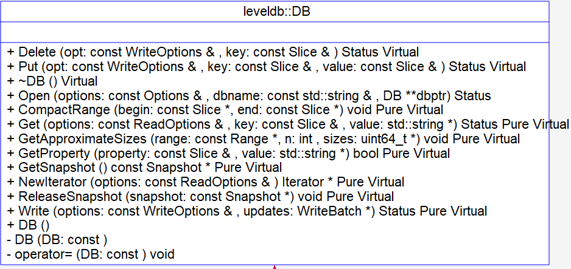
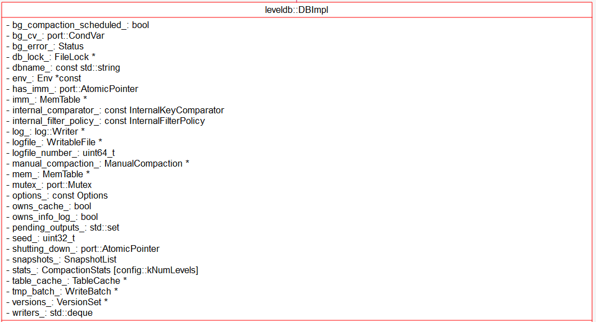

# DBImpl - 2018-11-14 - rsy

- [模块信息](#module_info)
- [模块概要](#module_in_brief)
- [模块功能](#module_function)
- [接口说明](#interface_specification)
- [相关依赖说明](#dependency_specification)
- [内部实现细节](#inner_detail)
- [参考资料](#reference)

&nbsp;   

## 模块信息

`include/leveldb/db.h`, `db/db_impl.h`, `db_impl.cc`

&nbsp;   

## 模块概要

   
   

&nbsp;   

## 模块功能

&nbsp;   

## 接口说明

- `DB::Open()`
- `DestroyDB()`

- `DBImpl::NewDB()`
- `DBImpl::DBImpl()`
- `DBImpl::~DBImpl()`

- `DBImpl::Get()`：
- `DBImpl::Put()`：就是 `DB::Put()`
- `DBImpl::Delete()`：就是 `DB::Delete()`
- `DBImpl::Write(WriteBatch*)`：Put / Delete 底层的最终实现。**写 log，写 memtable**
- `DBImpl::NewIterator()`：用来遍历 db（调用时的 version）
- `DBImpl::GetSnapshot()`：用户调用，获得当前 sequence 所标记的快照
- `DBImpl::ReleaseSnapshot()`：用户调用，释放不用的快照
- `DBImpl::CompactRange()`：针对 range 来进行 compaction

- `DBImpl::Recover()`：恢复 db 状态并且将恢复对于 version 日志操作
- `DBImpl::RecoverLogFile()`：对单个 log 进行回放，期间可能会执行 compaction

- `DBImpl::NewInternalIterator(SequenceNumber*)`：收集当前版本所有可用 iterator，产生一个 merging iterator（参数后面说）
- `DBImpl::BuildBatchGroup()`：整合一部分 WriteBatch（一部分是为了控制 size）
- `DBImpl::DeleteObsoleteFiles()`：回收每次 compaction 之后被废弃的文件
- `DBImpl::MakeRoomForWrite()`：如果 mem 空间不足，compaction 并创建新 mem（如果 level-0 文件过多就阻塞）
- `DBImpl::WriteLevel0Table(MemTable*, VersionEdit*, Version*)`：**将 memtable dump 成 sstable，不一定是 level-0**（参考 [VersionSet](https://github.com/rsy56640/read_and_analyse_levelDB/blob/master/architecture/DB/Version%20%26%20VersionSet%20-%202018-11-12%20-%20rsy.md)）；对于 Version 的修改记录在 `VersionEdit*` 里面
- `VersionSet::LogAndApply()`：应用 VersionEdit 增量，**写入 Manifest 文件**，每次 compaction 时调用
- `DBImpl::CompactMemTable()`
- `DBImpl::MaybeScheduleCompaction()`
- `DBImpl::DoCompactionWork(CompactionState*)`：通过读取提交的 `CompactionState*` 来 **完成实质性的 compaction**
- `DBImpl::BackgroundCompaction()`：负责 compaction 总体逻辑
- `DBImpl::InstallCompactionResults(CompactionState*)`：将 compact 过程中记录的操作（VersionEdit）生效，**加入 VersionSet**
- `DBImpl::FinishCompactionOutputFile(CompactionState*)`：输出文件之后的 finish 操作（包括**写入 filter-block，index-block 和 footer 等**，将新 sstable 加入 TableCache）
- `DBImpl::CleanupCompaction(CompactionState*)`：完成 compaction 之后的工作

&nbsp;   

## 相关依赖说明

### `DB::Open()` 调用层次

### `DestroyDB()` 调用层次

&nbsp;    

### `DBImpl::NewDB()` 调用层次

### `DBImpl::DBImpl()` 调用层次

### `DBImpl::~DBImpl()` 调用层次

&nbsp;    

### `DBImpl::Get()` 调用层次

### `DBImpl::Write(WriteBatch*)` 调用层次

- `DB::Put()`
- `DB::Delete()`

### `DBImpl::CompactRange()` 调用层次

- `DBImpl::CompactRange()`
  - `Version::OverlapInLevel()`：首先查看**和这些 range 存在 overlap 的最底层的 level**
  - `DBImpl::TEST_CompactMemTable()`：等待 memtable 进行 compaction （不管是否存在 overlap）
  - 循环调用 `DBImpl::TEST_CompactRange()`：然后遍历这些 level，分别对每层进行 compact range
      - `DBImpl::MaybeScheduleCompaction()`

&nbsp;   

### `DBImpl::Recover()` 调用层次

- `DB::Open()`：
  - `DBImpl::Recover()`：
      - `VersionSet::Recover()`：从 CURRENT 读 Manifest (VersionEdit)
      - 如果有 log 比 Manifest 文件中记录的 log 要新，那说明上次没来得及从内存 dump，于是从 log 回复数据，调用 `RecoverLogFile()`
      - `DBImpl::RecoverLogFile()`：打开指定的 log 文件，回放日志。期间可能会执行 compaction，产生新的 level-0 sstable 文件（`DBImpl::WriteLevel0Table(MemTable*, VersionEdit*, Version*)`），记录文件变动到 edit 中

### `DBImpl::RecoverLogFile()` 调用层次

- `DBImpl::Recover()`：如果需要从 log 回放数据
  - `DBImpl::RecoverLogFile()`：
      - `log::Reader::ReadRecord()`：读出具体信息
      - `WriteBatchInternal::SetContents()`：设置 WriteBatch
      - `WriteBatchInternal::InsertInto()`：将 WriteBatch 写入 memtable
      - 如果 mem 过大就 compact，调用 `DBImpl::WriteLevel0Table()`
      - 如果要继续用 mem 和 log，把资源给 mem_
      - 如果不继续用 mem，就调用 `DBImpl::WriteLevel0Table()` dump memtable

&nbsp;   

### `DBImpl::NewInternalIterator(SequenceNumber*)` 调用层次

`DBImpl::NewIterator()` 调用该函数生成 多路归并迭代器，用于生成 DBIter

### `DBImpl::BuildBatchGroup()` 调用层次

`DBImpl::Write(WriteBatch*)` -> `DBImpl::BuildBatchGroup()`

### `DBImpl::DeleteObsoleteFiles()` 调用层次

在 compaction 之后调用

- `DBImpl::CompactMemTable()`
- `DBImpl::BackgroundCompaction()`
- `DB::Open()`

### `DBImpl::MakeRoomForWrite()` 调用层次

- `DBImpl::CompactRange()`
  - `DBImpl::TEST_CompactMemTable()`
      - `DBImpl::Write(WriteBatch* = NULL)`：接下
  - `DBImpl::TEST_CompactRange()`

- `DB::Put()`，`DB::Delete()`
  - `DBImpl::Write(WriteBatch* != NULL)`：接下

- `DBImpl::Write(WriteBatch*)`
  - `DBImpl::MakeRoomForWrite(force = (WriteBatch* == NULL))`
      - `DBImpl::MaybeScheduleCompaction()`

### `DBImpl::WriteLevel0Table(MemTable*, VersionEdit*, Version*)` 调用层次

- `DB::Open()`
  - `DBImpl::Recover()`
      - `VersionSet::Recover()`：读 manifest
      - `DBImpl::RecoverLogFile()`：回放日志，可能调用 `DBImpl::WriteLevel0Table()`
            - `DBImpl::WriteLevel0Table()`：dump memtable

另一种见下图：`DBImpl::CompactMemTable()` -> `DBImpl::WriteLevel0Table()`

### `DBImpl::CompactMemTable()` 调用层次

`DBImpl::DoCompactionWork()` 中如果有 imm，就**等待** `DBImpl::CompactMemTable()`

`DBImpl::BackgroundCompaction()` 中如果有 imm，就 `DBImpl::CompactMemTable()` 然后**退出**

### `DBImpl::MaybeScheduleCompaction()` 调用层次

**这张图的实现细节在 [leveldb实现解析 - 淘宝-核心系统研发-存储](https://github.com/rsy56640/read_and_analyse_levelDB/blob/master/reference/DB%20leveldb%E5%AE%9E%E7%8E%B0%E8%A7%A3%E6%9E%90.pdf) 中最后 compact 部分有详细讲解。**

### `DBImpl::DoCompactionWork(CompactionState*)` 调用层次

`DBImpl::BackgroundCompaction()` -> `DBImpl::DoCompactionWork()`

### `DBImpl::BackgroundCompaction()` 调用层次

`DBImpl::MaybeScheduleCompaction()` -> schedule `DBImpl::BackgroundCompaction()`

### `DBImpl::InstallCompactionResults(CompactionState*)` 调用层次

`DBImpl::DoCompactionWork()` -> `DBImpl::InstallCompactionResults()`

### `DBImpl::FinishCompactionOutputFile(CompactionState*)` 调用层次

`DBImpl::DoCompactionWork()` -> `DBImpl::FinishCompactionOutputFile()`

### `DBImpl::CleanupCompaction(CompactionState*)` 调用层次

`DBImpl::BackgroundCompaction()` -> `DBImpl::CleanupCompaction()`

&nbsp;   

## 内部实现细节

### `DB::Open()`

### `DestroyDB()`

&nbsp;    

### `DBImpl::NewDB()`

### `DBImpl::DBImpl()`

### `DBImpl::~DBImpl()`

&nbsp;    

### `DBImpl::Get()`

### `DBImpl::Put()`

将用户 k-v 包装成 WriteBatch，调用 `DBImpl::Write(WriteBatch*)`

### `DBImpl::Delete()`

将用户 k-v 包装成 WriteBatch，调用 `DBImpl::Write(WriteBatch*)`

### `DBImpl::Write(WriteBatch*)`

- 将 `WriteBatch*` 收集进入 `writers_: std::deque<DBImpl::Writer*>`
- 调用 `DBImpl::BuildBatchGroup()` 整合一批 WriteBatch 为一个 `update: WriteBatch`
- 设置 sequece 为 last_sequence + 1
- **写入 log**：`log::Writer::AddRecord()`
- **写入 memtable**：`WriteBatchInternal::InsertInto()`
- 更新 last_sequence += 这个 `update` 的 count（`WriteBatchInternal::Count()`）
- 将 `update` 中的这一部分 WriteBatch 从 `writers_: std::deque<DBImpl::Writer*>` 中去掉

> sequence number 在写入 memtable 时会自增。   
> 具体参考 `WriteBatchInternal::InsertInto()` -> `WriteBatch::Iterate()`

### `DBImpl::NewIterator()`

- 调用 `DBImpl::NewInternalIterator()` 生成 `internal_iter`
- 再由 `NewDBIterator()` 包装成 遍历 db 的迭代器

### `DBImpl::CompactRange()`

- `Version::OverlapInLevel()`：首先查看**和这些 range 存在 overlap 的最底层的 level**
- `DBImpl::TEST_CompactMemTable()`：等待 memtable 进行 compaction （不管是否存在 overlap）
- 循环调用 `DBImpl::TEST_CompactRange()`：然后遍历这些 level，分别对每层进行 compact range，即调用 `DBImpl::MaybeScheduleCompaction()`

&nbsp;   

### `DBImpl::Recover()`

- 创建目录
- 检查 CURRENT
- 调用 `VersionSet::Recover()`，从 CURRENT 读 Manifest (VersionEdit)
- 检查有没有更新的 log，如果有 log 比 Manifest 文件中记录的 log 要新，那说明上次没来得及从内存 dump，于是**从 log 回放数据**，按照 **log 大小顺序**调用 `DBImpl::RecoverLogFile()`
- 更新 VersionSet 的 max sequence

### `DBImpl::RecoverLogFile()`

打开指定的 log 文件，回放日志。期间可能会执行 compaction，产生新的 level-0-sstable 文件，记录文件变动到 edit 中

- `log::Reader::ReadRecord()`：读出具体信息
- `WriteBatchInternal::SetContents()`：设置 WriteBatch
- `WriteBatchInternal::InsertInto()`：将 WriteBatch 写入 memtable
- 如果 mem 过大就 compact，调用 `DBImpl::WriteLevel0Table()`
- 如果要继续用 mem 和 log，把资源给 mem_
- 如果不继续用 mem，就调用 `DBImpl::WriteLevel0Table()` dump memtable

> `DBImpl::RecoverLogFile()`:  
> &emsp;&emsp;&emsp;&emsp; `log_number` -> `LogFileName` -> `SequentialFile` -> `log::Reader` -> `record (Slice)` -> `WriteBatch` -> `MemTable`->   
> &emsp;&emsp;&emsp;&emsp; 对于最后一个 log，&emsp;(1) 继续用 `mem` 和 log    
> &emsp;&emsp;&emsp;&emsp;&emsp;&emsp;&emsp;&emsp;&emsp;&emsp;&emsp;&emsp;&emsp;&emsp;(2) 不继续用，就 cmpact，`WriteLevel0Table()` 并且信息存入 VersionEdit

&nbsp;   

### `DBImpl::NewInternalIterator(SequenceNumber*)`

收集当前版本所有可用 iterator，产生一个 merging iterator

- **mem** iterator
- **imm**（如果有） iterator
- 当前 version 的 iterator（遍历 **sstable**，即 **TwoLevelIterator**）

然后调用 `MergingIterator()` 返回一个 **多路归并迭代器**

> 这个参数 `SequenceNumber*` 一开始让我感到诧异，因为函数只是从 `VersionSet::LastSequence()` 获取一个最新的 sequence number 给这个指针，其他啥都没做。   
> 然后这个 sequence 在 `DBImpl::NewIterator()` 紧接着传给 `NewDBIterator()`，**那为啥不在 `DBImpl::NewIterator()` 调用 `NewDBIterator()` 的时候直接给 `VersionSet::LastSequence()` 呢？**   
> 观察了一下想通了：原因在于 `DBImpl::NewIterator()` **没有上锁**，获得的 sequence number 可能和 `DBImpl::NewInternalIterator(SequenceNumber*)` 内部收集的 merging iterator 不一致。

### `DBImpl::BuildBatchGroup()`

`DBImpl::Write(WriteBatch*)` 调用 `DBImpl::BuildBatchGroup()`，将一部分 WriteBatch 拼接起来（一部分是因为控制 size），拼接的这一部分之后会在 `DBImpl::Write(WriteBatch*)` 中去掉。（`if(ready != last_writer) writers_.pop_front();`）

### `DBImpl::DeleteObsoleteFiles()`

保护正在进行的 compaction 文件，删除过期文件。（如果是 table 文件，调用 `TableCache::Evict()` 清除缓存）

> 下面抄自 [leveldb实现解析 - 淘宝-核心系统研发-存储](https://github.com/rsy56640/read_and_analyse_levelDB/blob/master/reference/DB%20leveldb%E5%AE%9E%E7%8E%B0%E8%A7%A3%E6%9E%90.pdf)

db 中当前 Version 的 sstable 均在 `VersionSet::current_` 中，并发的读写造成会有多个 Version 共存，`VersionSet::dummy_versions_` 中有包含 `VersionSet::current_` 所有正在服务的 Version。凡是正在服务的 Version 中的 sstable 文件都认为是 live 的。 `DeleteObsoleteFiles()` 删除 非-live 的 sstable 以及其他类型的废弃文件。

- 取得 `pending_output_` 中仍存在的以及 live 的 sstable 文件（`VersinoSet::AddLiveFiles()`，遍历 `VersionSet::dummy_versions_` 即可） ，作为所有 live 的文件
- 遍历 db 目录下所有的文件名，删除非 live 的 sstable 以及废弃的其他类型文件
  - log 文件保留大于 `VersionSet::log_number_` 以及辅助 log 文件
（`VersionSet::prev_log_number_`）
  - Manifest 文件只保留当前的
  - sstable 文件以及临时文件（repair 时会产生）只保留 live 的
  - CURRENT/LOG/LOCK 文件均保留

### `DBImpl::MakeRoomForWrite()`

[Compactions - Timing](https://github.com/google/leveldb/blob/master/doc/impl.md#timing) - Solution 2：**当 level-0 文件较多时，控制写入速率。**

> 下面这段抄自 [DBImpl - MakeRoomForWrite](https://dirtysalt.github.io/html/leveldb.html#org6a4ae1d)

- 如果允许 delay 的话并且 level-0 文件数目超过 slowdown 的阈值的话，那么就会先尝试 delay 1s，下次不会进行 delay
- 如果不是 force 的话并且 memtable 空间允许的话那么直接返回
- 剩下的逻辑就是 force 出一个 memtable 了，那么这个时候必须进行 compaction to level-0
- 先检查是否正在被 memtable compaction，如果正在的话那么等待
- 然后查看 level-0 文件数目是否过多，如果过多的话那么也等待（**限制写入速度保证系统 balance**）
- 最后创建新的 memtable 以及 logfile，将原来的 memtable 保存起来准备后台 compaction
- 发起 compaction（`DBImpl::MaybeScheduleCompaction()`），并且 force = false

按照性能角度出发的话，这种逻辑应该非常 make sense

### `DBImpl::WriteLevel0Table(MemTable*, VersionEdit*, Version*)`

**Dump Memtable**，不一定在 level-0，version 的修改记录在 `VersionEdit*` 里面

- 获取 memtable 的 iterator
- 将 iter 送入 `BuildTable()` 写入文件
- 文件信息存在 `FileMetaData`
- 调用 `Version::PickLevelForMemTableOutput(smallest, largest)` **找到尽可能低的 level 作为这个 sstable 的 level**
- 将 level 和 `FileMetaData` 信息存入 `VersionEdit*`（调用 `VersionEdit::AddFile()`）

### `DBImpl::CompactMemTable()`

- 调用 `DBImpl::WriteLevel0Table(imm_, &version_edit, version_base)`
- 更新当前的 log_number，应用 VersionEdit，生效新的 Version（`VersionSet::LogAndApply()` 应用 VersionEdit，写入 manifest 文件）
- 删除废弃文件（`DBImpl::DeleteObsoleteFiles()`）

### `DBImpl::MaybeScheduleCompaction()`

### `DBImpl::DoCompactionWork(CompactionState*)`

**实际的 compact 过程就是对多个已经排序的 sstable 做一次 merge 排序，丢弃掉相同 key 以及删除的数据。**

- 调用 `VersionSet::MakeInputIterator(Compaction*)` 获得遍历 compaction 文件的 iterator
- 遍历-iterator
  - 检查一下是否应该停止或等待：
      - 如果有 imm 就阻塞（调用 `DBImpl::CompactMemTable()`）
      - 当前 sstable 与 grandparent 的 overlap 是否超过阈值（`Compaction::ShouldStopBefore(internal_key)`）；如果是，调用 `DBImpl::FinishCompactionOutputFile()` 写完后立即退出 遍历-iterator
  - 判断 本-key 是否应该 drop
      - 如果是 新-key，就赋值给 cur_key（当前-key，有可能出现多个同值的 key）
      - 判断 当前-key（不是 本-key）的最后一个 sequence（不是 本-key 的 sequence） 是否小于快照。若小于（一定不是第一个出现的 新-key），则 drop；因为第一个 新-key 的 sequence 是 max，绝不会被 drop（**这一条好像是 drop 重复的 key，但我没看懂如果 本-key 的 sequence 比快照大那不就不 drop 了？？？**）
      - 若以下均成立，则 drop
          - 本-key 是 *删除操作*（`kTypeDeletion`）
          - 本-key 的 sequence 小于快照
          - 对于要将 本-key 写入 level-(n+1)，是否 level-(n+1) 以上的 level 不存在这个 key
  - 处理没有被 drop 的 k-v：
      - （第一次到这里）生成 sstable（`DBImpl::OpenCompactionOutputFile(CompactionState*)`）
      - `TableBuilder::Add()` **加入 k-v**
      - 如果 sstable 太大了，就 `DBImpl::FinishCompactionOutputFile()` 结束 sstable 的创建
- 调用 `DBImpl::FinishCompactionOutputFile()` **结束 sstable 的创建**
- 更新 compact 的统计信息
- 调用 `DBImpl:: InstallCompactionResults()` **更新 VersionSet，并写入 manifest 文件**

> 为啥总是把 iterator 的 ++ 放在 for 循环体代码块的最后，而不是 for 后面括号里。。。第二次看见这样子，，有啥用？？

### `DBImpl::BackgroundCompaction()`

负责 compaction 总体逻辑

- 如果有 imm，立即 `DBImpl::CompactMemTable()` 然后退出
- 准备 compaction 的信息：
  - 如果是 **手动** compaction，调用 `VersionSet::CompactRange()`
  - 如果是 **自动触发** compaction，调用 `VersionSet::PickCompaction()`
- 处理 compaction：
  - **自动触发** compaction：
      - `VersionEdit::DeleteFile(level-n)`
      - `VersionEdit::AddFile(level-n+1)`
      - `VersionSet::LogAndApply(VersionEdit*)`
  - **手动** compaction：
      - `DBImpl::DoCompactionWork()`
      - `DBImpl::CleanupCompaction()`
      - `DBImpl::DeleteObsoleteFiles()`
- 如果是 手动触发，最后整理一下 range 的信息，然后把 手动触发 设为 NULL

### `DBImpl::InstallCompactionResults(CompactionState*)`

- 删除 input 的两层 level：`Compaction::AddInputDeletions(VersionEdit* edit)` -> `VersionEdit::DeleteFile()`
- 加入 output 的 level+1 的 file：`VersionEdit::AddFile()`
- 更新 version，并写入 manifest 文件：`VersionSet::LogAndApply(VersionEdit*)`

### `DBImpl::FinishCompactionOutputFile(CompactionState*)`

- `TableBuilder::Finish()`：写入 filter-block，meta-block 和 footer 等
- 记录统计信息
- sync，close 文件
- 新生成的 sstable 文件加入 TableCache（调用 `TableCache::NewIterator(file_number)`）

### `DBImpl::CleanupCompaction(CompactionState*)`

- 如果上一次最后一个 sstable 未完成就异常结束，修复状态（`TableBuilder:: Abandon()`）
- 将已经成功完成的 sstable `FileNumber` 从 `pending_outputs_` 中去除

&nbsp;   

## 参考资料

- [leveldb - handbook](https://leveldb-handbook.readthedocs.io/zh/latest/)
- [leveldb - DBImpl](https://dirtysalt.github.io/html/leveldb.html#org6a4ae1d) 参考了不少
- [leveldb实现解析 - 淘宝-核心系统研发-存储](https://github.com/rsy56640/read_and_analyse_levelDB/blob/master/reference/DB%20leveldb%E5%AE%9E%E7%8E%B0%E8%A7%A3%E6%9E%90.pdf) 在 `DBImpl::xxxCompaction()` 方面讲得很清楚
- [LevelDB源码分析](https://wenku.baidu.com/view/b3285278b90d6c85ec3ac687.html)
- [庖丁解LevelDB之概览](http://catkang.github.io/2017/01/07/leveldb-summary.html)