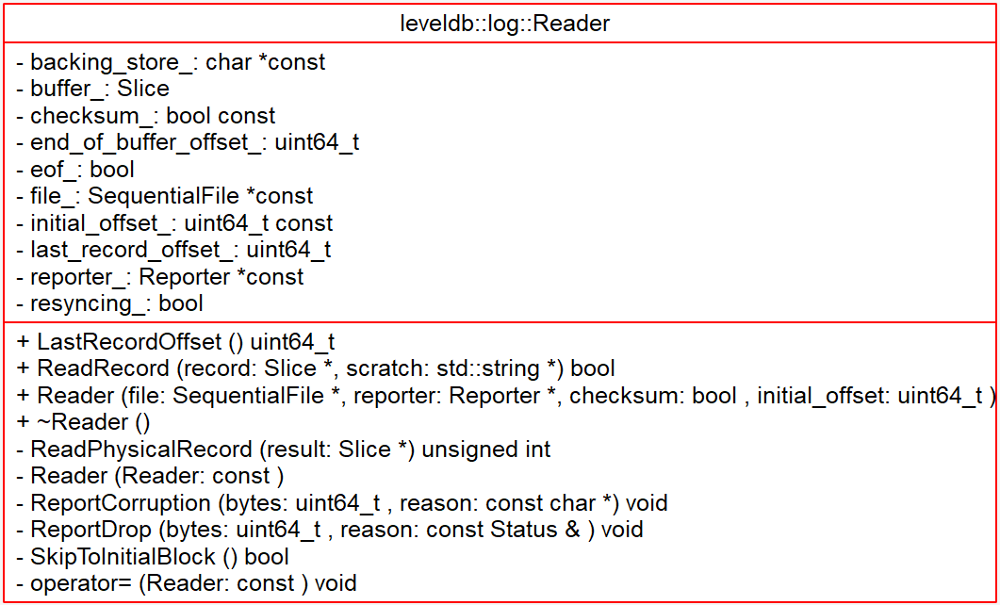
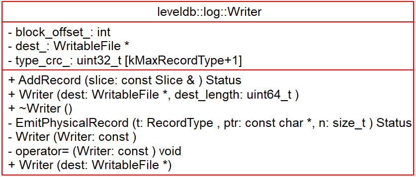
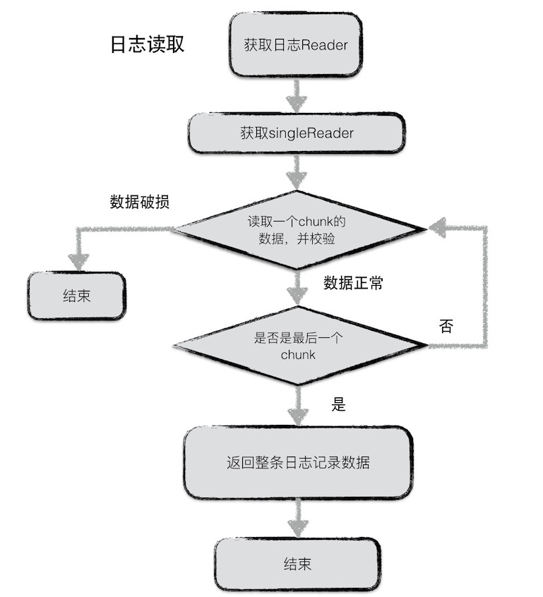

# Log - 2018-11-08 - rsy

- [模块信息](#module_info)
- [模块概要](#module_in_brief)
- [模块功能](#module_function)
- [接口说明](#interface_specification)
- [相关依赖说明](#dependency_specification)
- [内部实现细节](#inner_detail)
- [参考资料](#reference)

&nbsp;   

## 模块信息

`db/log_format.h`, `db/log_reader.h`, `db/log_reader.cc`, `db/og_writer.h`, `db/log_writer.cc`

&nbsp;   

## 模块概要

### [leveldb Log format](https://github.com/rsy56640/leveldb/blob/master/doc/log_format.md)

    block := record* trailer?
    record :=
      checksum: uint32     // crc32c of type and data[] ; little-endian
      length: uint16       // little-endian
      type: uint8          // FULL, FIRST, MIDDLE, LAST
      data: uint8[length]

&nbsp;   

## 模块功能

`DBImpl::Write()` 中先写 log，然后更新 memtable。   
所有的写操作都必须先成功的 append 到操作日志中，然后再更新内存 memtable。这样做有两点：

- 可以将随机的写 IO 变成 append，极大的提高写磁盘速度
- 防止在节点 down 机导致内存数据丢失，造成数据丢失，这对系统来说是个灾难。

如果遇到重启等情况，LevelDB就会将已经持久化的文件与日志进行一个merge操作，这就是LSM， 与HBase的恢复操作很相似。

&nbsp;   

## 接口说明

- `log::Writer::AddRecord()`：分块block，调用 `EmitPhysicalRecord()`
- `log::Writer::EmitPhysicalRecord()`：写入数据到文件
- `log::Reader::ReadRecord()`：读出下一个整个 `record`，如果不行，返回 false，`scratch` 是中间临时存储（因为有些 `record` 一次读不完）
- `log::Reader::SkipToInitialBlock()`：跳到要读的第一个 `record`
- `log::Reader::ReadPhysicalRecord()`：读文件，检验，结果放到 `backing_store_`

&nbsp;   

## 相关依赖说明

- `log::Reader::ReadRecord()` 在 `DBImpl::RecoverLogFile()` 和 `VersionSet::Recover()` 中调用，方式如下：

        while (reader.ReadRecord(&record, &scratch) && status.ok())

即持续地读，中间结果存储在 `scratch` 中，最后扔给 `record`。

&nbsp;   

## 内部实现细节

&nbsp;   

## 参考资料

- [leveldb-handbook](https://leveldb-handbook.readthedocs.io/zh/latest/)
- [leveldb实现解析 - 淘宝-核心系统研发-存储](https://github.com/rsy56640/read_and_analyse_levelDB/blob/master/reference/DB%20leveldb%E5%AE%9E%E7%8E%B0%E8%A7%A3%E6%9E%90.pdf)
- [LevelDB源码分析](https://wenku.baidu.com/view/b3285278b90d6c85ec3ac687.html)
- [levelDB源码分析-Log文件](https://blog.csdn.net/tankles/article/details/7663873)
- [跟吉姆一起读LevelDB 4.数据库恢复(1)](https://zhuanlan.zhihu.com/p/27400189)
- [跟吉姆一起读LevelDB 5.数据库恢复(2)](https://zhuanlan.zhihu.com/p/27417009)
- [跟吉姆一起读LevelDB 6.数据库恢复(3)](https://zhuanlan.zhihu.com/p/27467584)
- [levelDB - log](https://dirtysalt.github.io/html/leveldb.html#org2f37695)
- [leveldb源码分析之读写log文件](http://luodw.cc/2015/10/18/leveldb-08/)
- [log日志文件-leveldb源码剖析(4)](http://www.pandademo.com/2016/03/log-leveldb-source-dissect-4/)
- [LevelDB源码解析12.读取Record](https://zhuanlan.zhihu.com/p/44150093)
- [LevelDB源码分析之十六：.log文件](https://blog.csdn.net/caoshangpa/article/details/79098716)
- [LevelDB源码分析之十：LOG文件](https://blog.csdn.net/caoshangpa/article/details/78925719)
- [leveldb源码剖析---日志系统](https://blog.csdn.net/Swartz2015/article/details/69228711)
- [leveldb源码分析--日志](https://www.cnblogs.com/KevinT/p/3815522.html)
- [levelDB Log-writer](https://www.cnblogs.com/shenzhaohai1989/p/3905354.html)
- [LevelDB源码剖析之Env与log::Writer](http://mingxinglai.com/cn/2013/01/leveldb-log-and-env/)
- [leveldb源码学习--log](https://www.jianshu.com/p/524175e9f34d)