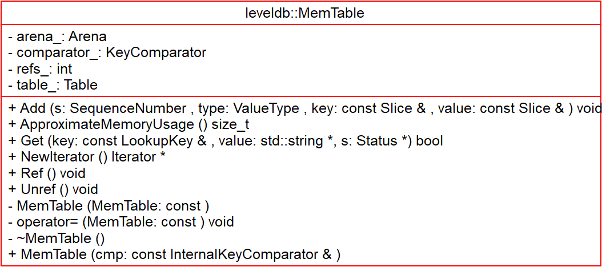

# Memtable - 2018-10-04 rsy

- [模块信息](#module_info)
- [模块概要](#module_in_brief)
- [模块功能](#module_function)
- [接口说明](#interface_specification)
- [相关依赖说明](#dependency_specification)
- [内部实现细节](#inner_detail)
- [参考资料](#reference)

&nbsp;   

## 模块信息

`db/memtable.h`, `db/memtable.cc`

&nbsp;   

## 模块概要

在 写 level-0 时将 `iter` 传入 `BuildTable` 中写入文件。

在 leveldb 中，所有内存中的 k-v 数据都存储在 `memtable` 中，物理 disk 则存储在 `SSTable` 中。在系统运行过程中，如果 `memtable` 中的数据占用内存到达指定值(`Options.write_buffer_size`)，则 Leveldb 就自动将 `memtable` 转换为 `immutable memtable`，并自动生成新的 `memtable`，也就是 Copy-On-Write 机制了。
`immutable memtable` 则被新的线程 Dump 到磁盘中， Dump 结束则该 `immutable memtable` 就可以释放了。（所以，同时最多会存在两个  `memtable`）

&nbsp;   

## 模块功能

&nbsp;   

## 接口说明

- `Add()`：提供 **插入**、**删除**（只记录删除操作，而不真正删除，直到 Compaction）
- `Get()`：查找
- `NewIterator()`：封装了 memtable 的迭代器，用于
  - `BuildTable` 写入文件
  - 给用户提供 iterator（`DBImpl::NewInternalIterator()`）

&nbsp;   

## 相关依赖说明

**从 WriteBatch 写入**：

- `DBImpl::Write(WriteBatch*)`
- `WriteBatchInternal::InsertInto(const WriteBatch*, MemTable*)`
- `WriteBatch::Iterate(MemTableInserter*)`：**将 k-v 不断迭代地插入 memtable**
- `MemTableInserter::Put()` 和 `MemTableInserter::Delete()` 转发给 `Memtable::Add()`

**Dump**：在 写 level-0 时将 `iter` 传入 `BuildTable` 中写入文件。

&nbsp;   

## 内部实现细节

内存数据库中，key称为internalKey，其由三部分组成：

- 用户定义的key：这个key值也就是原生的key值
- 序列号：leveldb中，每一次写操作都有一个sequence number，标志着写入操作的先后顺序。由于在leveldb中，可能会有多条相同key的数据项同时存储在数据库中，因此需要有一个序列号来标识这些数据项的新旧情况。序列号最大的数据项为最新值
- 类型：标志本条数据项的类型，为更新还是删除

排序基于 user key 的 sequence number，其排序比较依据依次是：

- 首先根据 user key 按升序排列
- 然后根据 sequence number 按降序排列
- 最后根据 value type 按降序排列（这个其实无关紧要）

>讲道理 `memtable` 应该给一个工厂接口的，毕竟dtor是私有的，不过写自动存储期不能编译就是了。

&nbsp;   
KV 的实际存储格式：

- `Add()`：把 `key + ValueType + value` 序列化之后塞进去
- `Get()`：反序列化，找 key
- `NewIterator()`：memtable 对 key 的查找和遍历封装成 `MemTableIterator`。 底层直接使用 SkipList 的类 Iterator 接口
- `MemTableIterator`：用于解析格式、遍历

&nbsp;   

## 参考资料

- [leveldb实现解析 - 淘宝-核心系统研发-存储](https://github.com/rsy56640/read_and_analyse_levelDB/blob/master/reference/DB%20leveldb%E5%AE%9E%E7%8E%B0%E8%A7%A3%E6%9E%90.pdf)
- [LevelDB源码分析](https://wenku.baidu.com/view/b3285278b90d6c85ec3ac687.html)
- [leveldb MemTable](https://dirtysalt.github.io/html/leveldb.html#org2c88c7b)
- [leveldb MemTable](https://dirtysalt.github.io/html/leveldb.html#orgf9c3f07)
- [leveldb-handlebook 内存数据库](https://leveldb-handbook.readthedocs.io/zh/latest/memorydb.html#id9)
- [leveldb源码分析之memtable](http://luodw.cc/2015/10/17/leveldb-06/)
- [MemTable与SkipList-leveldb源码剖析(3)](http://www.pandademo.com/2016/03/memtable-and-skiplist-leveldb-source-dissect-3/)
- [LevelDB源码分析之八：memtable](https://blog.csdn.net/caoshangpa/article/details/78901792)
- [LevelDB源码剖析之MemTable](http://mingxinglai.com/cn/2013/01/leveldb-memtable/)
- [leveldb memtable](https://www.cnblogs.com/shenzhaohai1989/p/3904166.html)
- [leveldb源码分析--Memtable](https://www.cnblogs.com/KevinT/p/3814012.html)