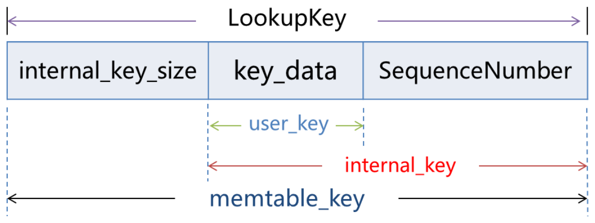
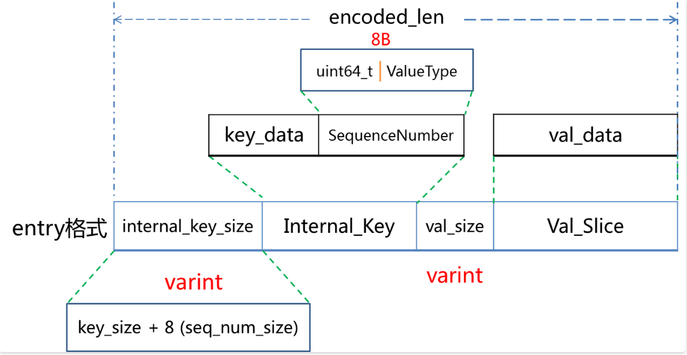
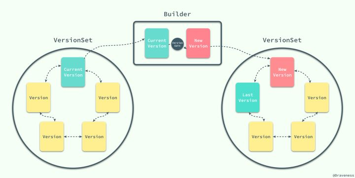
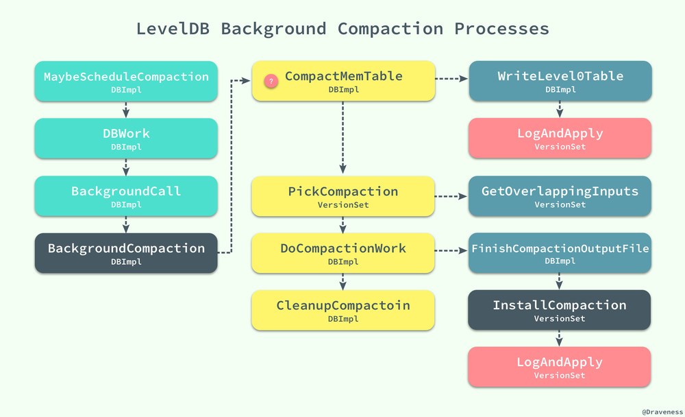

- [Status](#status)
- [KeyFormat](#key_format)
- [WriteBatch](#write_batch)
- [TableCache](#table_cache)
- [Memtable](#memtable)
- [Builder](#build_table)
- [ValueType & SequenceNumber](#valuetype_sequence)
- [Manifest & VersionEdit](#manifest_versionedit)
- [Recover](#recover)
- [Log](#log)
- [Version & VersionSet](#version_versionset)
- [DBImpl](#dbimpl)

&nbsp;   

## [Status](https://github.com/rsy56640/read_and_analyse_levelDB/blob/master/architecture/DB/Status-2018-10-02-dz.md)

Status 类封装对 db 操作返回的结果，除 success，都可以包含错误码和两条错误信息。

&nbsp;   

## [KeyFormat](https://github.com/rsy56640/read_and_analyse_levelDB/blob/master/architecture/DB/dbformat_key-2018-10-01-ss.md)

   
   

&nbsp;   

## [WriteBatch](https://github.com/rsy56640/read_and_analyse_levelDB/blob/master/architecture/DB/WriteBatch%20-%202018-10-01%20-%20rsy.md)

leveldb 内部的一个批量写的结构，在 leveldb 为了提高插入和删除的效率，在其插入过程中都采用了批量集合相邻的多个具有相同同步设置的写请求以批量的方式进行写入。

&nbsp;   

## [TableCache](https://github.com/rsy56640/read_and_analyse_levelDB/blob/master/architecture/DB/TableCache%20-%202018-09-30%20-%20rsy.md)

`TableCache` 缓存 `Table` 对象，每个 DB 一个。

`TableCache` 的 k-v 格式：

- 以 `file_number` 作 key
- 以 `TableAndFile` 对应的预加载索引作为 value

table cache 缓存的是 sstable 的索引数据

简单梳理下到 `TableCache` 的查找流程

- 用户提交 key 查询，交由 `Status DBImpl::Get()` ，获取两种 `MemTable` 和当前 `Version`
- 依次查询 `memtable`、`immutable memtable`
- 未找到则在当前 `Version`上 `Status Version::Get()`，依次从最低 level 到最高 level 查询直至查到
- 在每层确定可能包含该 key 的 SSTable 文件后，就会在所属 `VersionSet` 的 `table_cache` 中继续查询，即调用 `Status TableCache::Get()`

另外，`TableCache` entry 的插入在 Compaction 时也有体现，每当通过 Compatction 生成新的 SSTable 文件，也会以验证正常可用的方式更新该 SSTable 的索引信息到 `TableCache`。

&nbsp;   

## [Memtable](https://github.com/rsy56640/read_and_analyse_levelDB/blob/master/architecture/DB/Memtable%20-%202018-10-04%20-%20rsy.md)

k-v 的实际存储格式：

在 写 level-0 时将 `iter` 传入 `BuildTable` 中写入文件。   
在 leveldb 中，所有内存中的 k-v 数据都存储在 `memtable` 中，物理 disk 则存储在 `SSTable` 中。在系统运行过程中，如果 `memtable` 中的数据占用内存到达指定值(`Options.write_buffer_size`)，则 leveldb 就自动将 `memtable` 转换为 `immutable memtable`，并自动生成新的 `memtable`，也就是 Copy-On-Write 机制了。
`immutable memtable` 则被新的线程 Dump 到磁盘中， Dump 结束则该 `immutable memtable` 就可以释放了。（所以，同时最多会存在两个  `memtable`）

&nbsp;   

## [Builder](https://github.com/rsy56640/read_and_analyse_levelDB/blob/master/architecture/DB/Builder%20-%202018-10-03%20-%20rsy.md)

为 level-? 创建 sstable，之后选择合适的 level（`DBImpl::WriteLevel0Table()` -> `Version::PickLevelForMemTableOutput()`）

&nbsp;   

## [ValueType & SequenceNumber](https://github.com/rsy56640/read_and_analyse_levelDB/blob/master/architecture/DB/ValueType%20%26%20SequenceNumber%202018-11-07%20-%20rsy.md)

- `ValueType`：顺序写（sequential writing）的策略使得数据不可被更改，于是标记 “delete” 操作。占 **8** bits。在顶层调用 `Put()` 或 `Delete()` 后转发给 [WriteBatch](https://github.com/rsy56640/read_and_analyse_levelDB/blob/master/architecture/DB/WriteBatch%20-%202018-10-01%20-%20rsy.md)，在每一个 K-V `record` 中存储
- `SequenceNumber`：标识每一次更新的版本。占 **56** bits。在 [WriteBatch](https://github.com/rsy56640/read_and_analyse_levelDB/blob/master/architecture/DB/WriteBatch%20-%202018-10-01%20-%20rsy.md) 中记录（为一批 `record`）

[WriteBatch](https://github.com/rsy56640/read_and_analyse_levelDB/blob/master/architecture/DB/WriteBatch%20-%202018-10-01%20-%20rsy.md) 在 `InsertInto()` 中写入 memtable，`InsertInto()` 先拿出来 sequence number，然后中调用 `Iterate()` 不断迭代地将 batch 中的数据写入（每次调用 `Memtable::Add()`，**sequence 自增**）

&nbsp;   

## [Manifest & VersionEdit](https://github.com/rsy56640/read_and_analyse_levelDB/blob/master/architecture/DB/Manifest%20%26%20VersionEdit%20-%202018-11-07%20-%20rsy.md)

**每一次 compact 都会改变当前 Version，VersionEdit 记录了 Version 的增量。通过 `VersionSet::Builder` 将 VersionEdit 融进 Version。**

Manifest:
> A MANIFEST file lists the set of sorted tables that make up each level, the corresponding key ranges, and other important metadata. A new MANIFEST file (with a new number embedded in the file name) is created whenever the database is reopened. The MANIFEST file is formatted as a log, and changes made to the serving state (as files are added or removed) are appended to this log.

为了避免进程崩溃或机器宕机导致的数据丢失，LevelDB 需要将元信息数据持久化到磁盘，承担这个任务的就是 Manifest 文件。可以看出每当有新的 Version 产生都需要更新 Manifest，很自然的发现这个新增数据正好对应于 VersionEdit 内容，也就是说 Manifest 文件记录的是一组 VersionEdit 值，在 Manifest 中的一次增量内容称作一个 Block，其内容如下：**就是 VersionEdit 的内容**。

Current:
> CURRENT is a simple text file that contains the name of the latest MANIFEST file.

&nbsp;   

## [Recover](https://github.com/rsy56640/read_and_analyse_levelDB/blob/master/architecture/DB/Recover%20-%202018-11-08%20-%20rsy.md)

数据库每次启动时，都会有一个 recover 的过程，简要地来说，就是利用 Manifest 信息重新构建一个最新的 version

&nbsp;   

## [Log](https://github.com/rsy56640/read_and_analyse_levelDB/blob/master/architecture/DB/Log%20-%202018-11-08%20-%20rsy.md)

`DBImpl::Write()` 中先写 log，然后更新 memtable。   
所有的写操作都必须先成功的 append 到操作日志中，然后再更新内存 memtable。这样做有两点好处：

- 可以将随机的写 IO 变成 append，极大的提高写磁盘速度
- 防止在节点 down 机导致内存数据丢失，造成数据丢失，这对系统来说是个灾难。

如果遇到重启等情况，levelDB 就会将已经持久化的文件与日志进行一个 merge 操作

**内存对象 => 二进制数组(Slice对象) => leveldb::log 切割成小块并打上 hash(crc32) => 写入硬盘**

&nbsp;   

## [Version & VersionSet](https://github.com/rsy56640/read_and_analyse_levelDB/blob/master/architecture/DB/Version%20%26%20VersionSet%20-%202018-11-12%20-%20rsy.md)

保留旧的数据，是为了支持旧版本的查询操作（compact 时发生读操作；不会发生旧版本的写，因为 sequential-writing），于是自然地引入了版本控制的概念。

leveldb 对单版本的 sstable 文件管理，主要集中在 Version 类中。**Version 不会修改其管理的 sstable 文件，只有读取操作**。

将每次 compact 后的最新数据状态定义为 Version，也就是当前 db 元信息以及每个 level 上具有最新数据状态的 sstable 集合。 compact 会在某个 level 上新加入或者删除一些 sstable，但可能这个时候，那些要删除的 sstable 正在被读，为了处理这样的读写竞争情况，基于 sstable 文件一旦生成就不会改动的特点，每个 Version 加入引用计数，读以及解除读操作会将引用计数相应加减一。 这样， db 中可能有多个 Version 同时存在（提供服务） ，它们通过链表链接起来。当 Version 的引用计数为 0 并且不是当前最新的 Version 时，它会从链表中移除， 对应的， 该 Version 内的 sstable 就可以删除了（这些废弃的 sstable 会在下一次 compact 完成时被清理掉）。

### Version 版本类

这个类主要功能

- 首先是提供了在**当前版本搜索键值的 Get 方法** -- `Version::Get()`
- 其次是为上层调用提供了 **收集当前版本所有文件的迭代器** -- `Version::AddIterators()` 
- 为合并文件提供了 **判断键值范围与文件是否有交集** 的辅助函数 -- `Version::OverlapInLevel()`
- 最后是提供了 memtable compact 的 level -- `Version::PickLevelForMemTableOutput()`

Version 是管理某个版本的所有 sstable 的类，就其导出接口而言，无非是遍历 sstable，查找 k/v。以及为 compaction 做些事情，给定 range，检查重叠情况。

&nbsp;   

### VersionSet
管理整个 db 的当前状态，负责包括 Log, Compaction, Recover 等。

&nbsp;   

## [DBImpl](https://github.com/rsy56640/read_and_analyse_levelDB/blob/master/architecture/DB/DBImpl%20-%202018-11-14%20-%20rsy.md)

- 实现了所有面对用户的接口
- 负责 Recover，Log，Compaction 等

