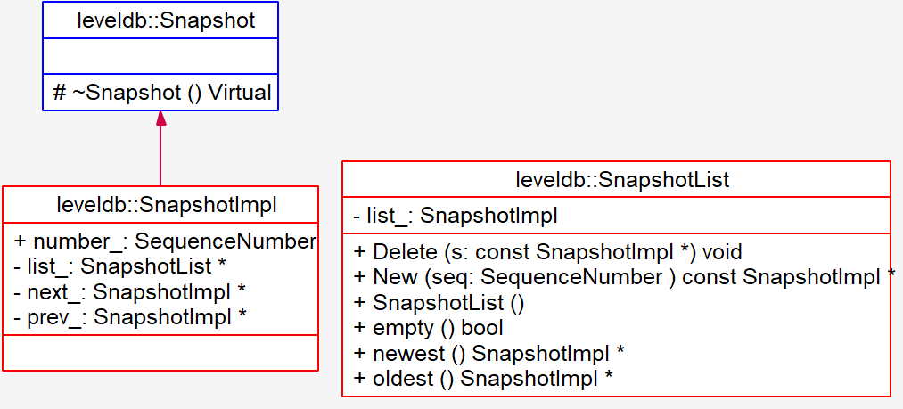

# Snapshot - 2018-11-07 - rsy

- [模块信息](#module_info)
- [模块概要](#module_in_brief)
- [模块功能](#module_function)
- [接口说明](#interface_specification)
- [相关依赖说明](#dependency_specification)
- [内部实现细节](#inner_detail)
- [参考资料](#reference)

&nbsp;   

## 模块信息

`include/leveldb/snapshot.h`

&nbsp;   

## 模块概要

依赖于 `SequnceNumber` 来标识时间点， leveldb 中 `Snapshot` 的实现很简单，只需要记录产生 `Snapshot` 时的 `SequnceNumber` 即可， 所有 `Snapshot` 用 double-linked list 组织，新加入的添加在列表头。

> `Snapshot` 集合在 leveldb 里面组织成为一个链表，oldest 的节点必然最小的 snapshot。对于每一个 snapshot 配备一个 sequence number, 所以很明显 oldest 的节点的 sequence number 应该是最小的。每次进行 compaction 的时候会判断当前最小的 sequence number 是多少然后**将一些不必要的节点删除**。另外在查询 key 的时候也会结合这个 snapshot sequence number **结合成为一个复合 key 进行查询**。

&nbsp;   

## 模块功能

&nbsp;   

## 接口说明

`SnapshotList`：维护一个双向链表

- `Delete(SnapshotIml*)`：
- `New(SequenceNumber)`：
- `empty()`：
- `newest()`：
- `oldest()`：

&nbsp;   

## 相关依赖说明

`DBImpl` 含有一个 `SnapshotList`，用来维护用户的快照。

- `DB::GetSnapshot()`：用户对当前 DB 生成快照
- `DB::ReleaseSnapshot(result)`：当用户弃置快照时调用，**DB 对快照资源不管理**

&nbsp;   

## 内部实现细节

用户生成快照时，调用 `DB::GetSnapshot()`，即提供一个目前最新的 sequence number，添加到尾巴。`prev_` 是最新的，`next_` 是 sequence number 增大的方向。

&nbsp;   

另外，注意到 `SnapshotList` 没有禁用 copy ctor，也没写 dtor。   
在 `DB::GetSnapshot()` 上的注释中表明：  
> The caller must call `DB::ReleaseSnapshot(result)` when the snapshot is no longer needed.

所以其实也不用担心，因为资源由用户生成（提供 sequence number），也由用户释放。

&nbsp;   

## 参考资料

- [leveldb-handbook](https://leveldb-handbook.readthedocs.io/zh/latest/)
- [leveldb实现解析 - 淘宝-核心系统研发-存储](https://github.com/rsy56640/read_and_analyse_levelDB/blob/master/reference/DB%20leveldb%E5%AE%9E%E7%8E%B0%E8%A7%A3%E6%9E%90.pdf)
- [LevelDB源码分析](https://wenku.baidu.com/view/b3285278b90d6c85ec3ac687.html)
- [跟吉姆一起读LevelDB 10.Delete与Snapshot](https://zhuanlan.zhihu.com/p/27519715)
- [leveldb源码分析之快照SnapShots](http://luodw.cc/2015/10/31/leveldb-15/)