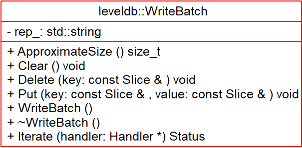

# WriteBatch - 2018-10-01 rsy

- [模块信息](#module_info)
- [模块概要](#module_in_brief)
- [模块功能](#module_function)
- [接口说明](#interface_specification)
- [相关依赖说明](#dependency_specification)
- [内部实现细节](#inner_detail)
- [参考资料](#reference)

&nbsp;   

## 模块信息

`include/leveldb/write_batch.h`, `db/write_batch_internal.h`, `db/write_batch.cc`

&nbsp;   

## 模块概要

leveldb 内部的一个批量写的结构，在 leveldb 为了提高插入和删除的效率，在其插入过程中都采用了批量集合相邻的多个具有相同同步设置的写请求以批量的方式进行写入。

&nbsp;   

## 模块功能

&nbsp;   

## 接口说明

- `Put()`：存储 put 操作
- `Delete()`：存储 delete 操作
- `Iterate()`：遍历内容 经handler接口 存到 memtable 中

`class WriteBatchInternal`：工具类

- `WriteBatchInternal::Count()`：返回个数
- `WriteBatchInternal::SetCount()`
- `WriteBatchInternal::Sequence()`：返回 sequence number
- `WriteBatchInternal::SetSequence()`
- `WriteBatchInternal::Contents()`：返回内容
- `WriteBatchInternal::SetContents()`
- `WriteBatchInternal::Append(WriteBatch* dst, const WriteBatch* src)`：拼接两个 WriteBatch
- `WriteBatchInternal::InsertInto(const WriteBatch* b, MemTable* memtable)`：将 WriteBatch 写入 memtable，转发给了 `WriteBatch::Iterate()`

&nbsp;   

## 相关依赖说明

上层方法调用：当插入数据时，`DBImpl::Put()` 和 `DBImpl::Delete()` 调用 `WriteBatch::Put()` 和 `WriteBatch::Delete()` 方法将记录添加进 `WriteBatch::rep_`，然后 `DBImpl::Write(WriteBatch*)` 调用 `WriteBatchInternal::InsertInto()` 方法。

数据库流程：先是调用 `DB::Put()` 和 `DB::Delete()` 方法，这两个方法再调用 `Write()` 将数据写到 `memtable`。`Write()` 最终是先将 `WriteBatch::rep_`中的记录先添加进 log 文件，最后调用 `WriteBatchInternal::InsertInto()` 方法，将记录添加进 memtable。

&nbsp;   

## 内部实现细节

`class WriteBatchInternal` 封装了辅助操作 `WriteBatch` 的非公开接口。

`Status WriteBatchInternal::InsertInto(const WriteBatch* b, MemTable* memtable)`：  
&emsp;  将 `WriteBatch` 内容全部插入到 `MemTable` 里面去，调用 `WriteBatch::Iterate()`

&nbsp;   

**`WriteBatch::Iterate()`**：从 writebatch 写入 memtable

- 先拿出来 sequence number
- 然后将 k-v 不断迭代地插入 memtable，调用 `Memtable::Add()`
  - `mem_->Add(sequence_, kTypeValue, key, value); ` ，sequence 自增
  - `mem_->Add(sequence_, kTypeDeletion, key, Slice());`，sequence 自增

&nbsp;   

存储格式：

    // WriteBatch::rep_ :=
    //      sequence: fixed64
    //      count: fixed32
    //      data: record[count]
    // record :=
    //      kTypeValue varstring varstring 
    //      kTypeDeletion varstring
    // varstring :=
    //      len: varint32
    //      data: uint8[len]

&nbsp;   

`size_t WriteBatch::ApproximateSize();` 的实现是假的，而且也并没有被使用。

&nbsp;   

`Status WriteBatch::Iterate(Handler* handler) const;`：遍历内容存放到 handler 对象里面。

&nbsp;   

>**（转）**为什么 leveldb 采用了这样的其中一个线程去批量操作而其他线程进行等待的方式呢？我们知道 leveldb 在实际插入过程中会有一系列的判断，和写日志到磁盘的操作。而首先这些判断都是在保持锁的情形下进行的，这里其实也就注定了只能是串行的；其次对于写磁盘，将多次写合并为一次写入会显著的提高效率，相当于 N * 磁盘寻址时间 + 写入时间总和变为了 一次磁盘寻址时间 + 写入时间总和，即节省了（N - 1）次磁盘寻址时间。

&nbsp;   

## 参考资料

- [leveldb实现解析 - 淘宝-核心系统研发-存储](https://github.com/rsy56640/read_and_analyse_levelDB/blob/master/reference/DB%20leveldb%E5%AE%9E%E7%8E%B0%E8%A7%A3%E6%9E%90.pdf)
- [leveldb源码分析--WriteBatch](https://www.cnblogs.com/KevinT/p/3813635.html)
- [leveldb源码分析之WriteBatch](http://luodw.cc/2015/10/30/leveldb-14/)
- [leveldb-handbook](https://leveldb-handbook.readthedocs.io/zh/latest/rwopt.html#batch)
- [leveldb](https://dirtysalt.github.io/html/leveldb.html#orgf584809)