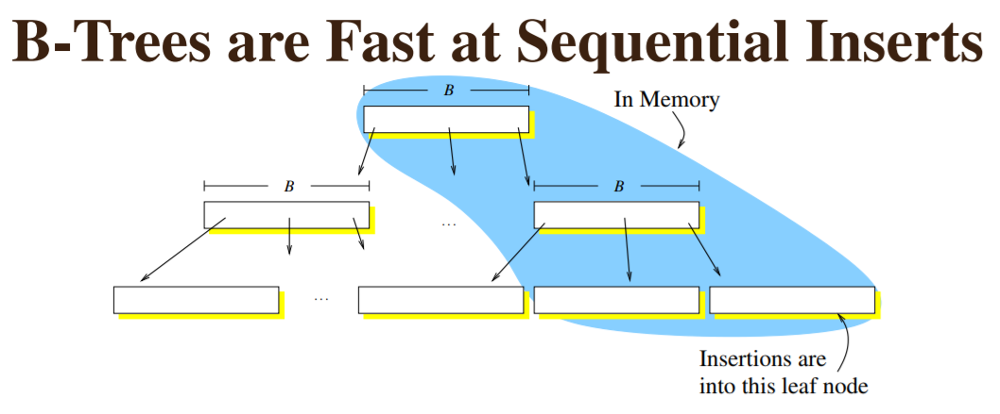

# LSM - 2018-10-06 rsy

- [模块概要](#module_in_brief)
- [参考资料](#reference)

&nbsp;   

## 模块概要

B树在插入的时候，如果是最后一个node,那么速度非常快，因为是顺序写。

但如果有更新插入删除等综合写入，最后因为需要循环利用磁盘块，所以会出现较多的随机I/O。大量时间消耗在磁盘寻道时间上。

解决思路：

- 放弃部分读性能，使用更加面向顺序写的树的结构来提升写性能。
  - COLA (Cache-Oblivious Look ahead Array)（e.g. tokuDB）
  - LSM tree (Log-structured merge Tree)（e.g. levelDB, HBase, Cassandra）

&nbsp;   

LSM：放弃磁盘读性能来换取写的顺序性。   
为什么用读换写：

- 内存的速度远超磁盘，1000倍以上。而读取的性能提升，主要还是依靠内存命中率而非磁盘读的次数
- 写入不占用磁盘的io，读取就能获取更长时间的磁盘io使用权，从而也可以提升读取效率

所以读性能受影响较小，而写性能则会获得较大幅度的提升，基本上是 5~10 倍左右。

&nbsp;   

LSM的思想，在于对数据的修改增量保持在内存中，达到指定的限制后将这些修改操作批量写入到磁盘中，相比较于写入操作的高性能，读取需要合并内存中最近修改的操作和磁盘中历史的数据，即需要先看是否在内存中，若没有命中，还要访问磁盘文件。

将 随机写 改为 顺序写，大大提高了 I/O 速度。   
核心思想是：

- 对变更进行批量 & 延时处理
- 通过归并排序将更新迁移到硬盘上

文件是不可修改的，他们永远不会被更新，新的更新操作只会写到新的文件中。通过周期性的合并这些文件来减少文件个数。   

但是读操作会变的越来越慢随着 sstable 的个数增加，因为每一个 sstable 都要被检查。最基本的的方法就是页缓存（也就是 leveldb 的 TableCache，将 sstable 按照 LRU 缓存在内存中）在内存中，减少二分查找的消耗。即使有每个文件的索引，随着文件个数增多，读操作仍然很慢。通过周期的合并文件，来保持文件的个数，因此读操作的性能在可接收的范围内。即便有了合 并操作，读操作仍然会访问大量的文件，大部分的实现通过布隆过滤器来避免大量的读文件操作，布隆过滤器是一种高效的方法来判断一个 sstable 中是否包 含一个特定的 key。

我们交换了读和写的随机 I/O。这种折衷很有意义，我们可以通过软件实现的技巧像布隆过滤器或者硬件（大文件 cache）来优化读性能。

&nbsp;   

## 参考资料

- [Log Structured Merge Trees(LSM) 原理](http://www.open-open.com/lib/view/open1424916275249.html)
- [LSM 算法的原理是什么？ - 知乎](https://www.zhihu.com/question/19887265)
- [B+树 LSM 树 COLA树 原理及在海量存储中的应用](https://blog.csdn.net/anderscloud/article/details/7181085)
- [数据库如何抵抗随机IO：问题、方法与现实](http://wangyuanzju.blog.163.com/blog/static/13029201132154010987)
- [日志结构的合并树 The Log-Structured Merge-Tree](https://www.cnblogs.com/siegfang/archive/2013/01/12/lsm-tree.html)