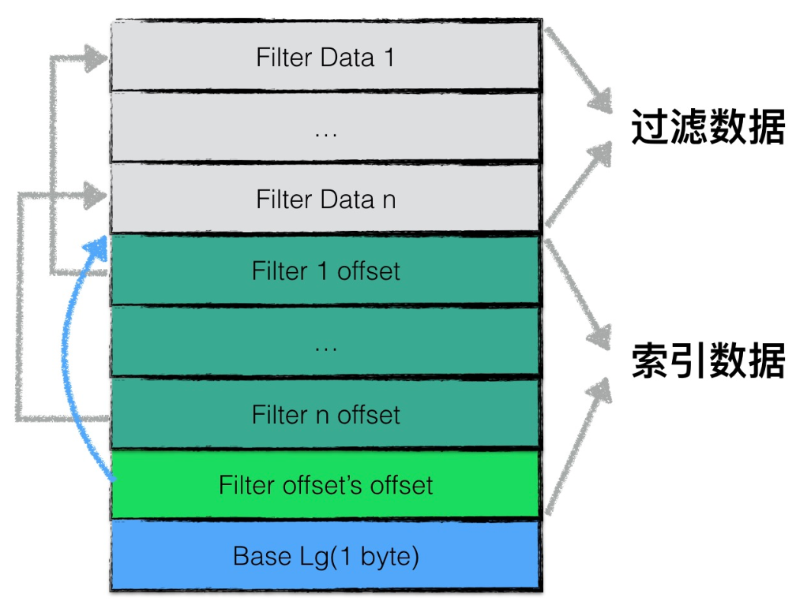

- [FilterBlock](#FilterBlock)
- [Block](#Block)
- [Table](#Table)
- 
- 
- 

&nbsp;   

## [FilterBlock](https://github.com/rsy56640/read_and_analyse_levelDB/blob/master/architecture/SSTable/FilterBlock%20-%202018-10-03%20-%20rsy.md)

`filter block` 就是 `meta block`

&nbsp;   

## [Block](https://github.com/rsy56640/read_and_analyse_levelDB/blob/master/architecture/SSTable/Block%20-%202018-10-02%20-%20rsy.md)

&nbsp;   

## [Table]()

>（转）data index block 组织形式和 data block 非常类似，只不过有两个不同。1)data index block从不刷新直到Table构造完成之后才会刷新，所以 对于一个table而言的话只有一个data index block. 2)data index block 添加的 key/value 是在 data block 形成的时候添加的，添加 key 非常取巧 ，是上一个data block和这个 data block 的一个 key seperator。比如上一个 data block 的 max key 是 "abcd"，而这个 data block 的min key是 "ad"。那么这个 seperator 可以设置成为 "ac"。seperator 的生成可以参考 Comparator。使用尽量短的 seperator 可以减小磁盘开销并且提高效率。而对于添加的 value 就是这个 data block 的 offset.同样在 data index block 也会存在 restart point。   
>然后看看进行一个key的query是如何进行的。首先读取出 data index block(这个部分可以常驻内存)，得到里面的restart point部分。针对 restart point 进行二分。因为restart point指向的key都是全量的key.如果确定在某两个restart point之间之后，就可以遍历这个restart point之间范围分析seperator. 得到想要查找的seperator之后对应的value就是某个data block offset.读取这个data block和之前的方法一样就可以查找key了。对于遍历来说，过程是一样的。   
>这里我们稍微分析一下这样的工作方式的优缺点。对于写或者是merge来说的话，效率相当的高，所有写都是顺序写并且还可以进行压缩。影响写效率的话一个重要参数就是flush block的参数。 但是对于读来说的话，个人觉得过程有点麻烦，但是可以实现得高效率。对于flush block调节会影响到data index block和data block占用内存大小。如果flush block过大的话， 那么会造成data index block耗费内存小，但是每次读取出一个data block内存很大。如果flush block过小的话，那么data index block耗费内存很大，但是每次读取data block内存很小。 而restart point数量会影响过多的话，那么可能会占用稍微大一些的内存空间，但是会使得查找过程更快(遍历数更少)。   

&nbsp;   

## 

&nbsp;   

## 

