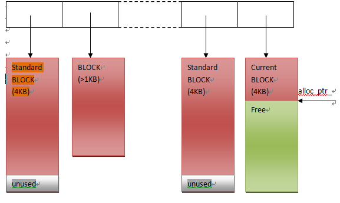

# util 整合

- [Arena](#Arena)
- [Coding](#Coding)
- [ShardedLRUCache](#ShardedLRUCache)
- 
- 
- 

&nbsp;   

## [Arena](https://github.com/rsy56640/read_and_analyse_levelDB/blob/master/architecture/util/Arena/arena%20-%202018-09-30%20-%20rsy.md)

Arena 主要与 MemTable 关联使用，实际主要用于 SkipList 中的 Node 内存分配，统一 MemTable 的内存分配需求，减少内存分配的实际系统调用次数（尤其针对小块内存），减少内存分配中的空洞（碎片），但也会造成一定的内存浪费；统一内存释放，不必频繁 new/delete；鉴于 Arena 在 leveldb 中的使用场景不需考虑线程安全。Arena 的实现简单轻量，代码总计百余行，服务于 leveldb 的定制需求，提高应用性能，并且提供了内存对齐的版本。

&nbsp;   

## [Coding](https://github.com/rsy56640/read_and_analyse_levelDB/blob/master/architecture/util/Coding/coding%20-%202018-09-06%20-%20rsy.md)

用于压缩 int 所占的存储空间的一套编解码工具。

&nbsp;   

## [ShardedLRUCache](https://github.com/rsy56640/read_and_analyse_levelDB/blob/master/architecture/util/LRU/cache%20-%202018-09-20%20-%20rsy.md)

**Cache 的主要流程**：   

- 查询会先在memTable中找，如果没找到，会去读index，确定在哪个block中，再去block中读， 这至少需要2次磁盘读取
- 这里的cache分两种：
    - TableCache的key为ssTable名称，值包括磁盘文件指针，以及表结构，表结构又包括 index内容及block信息。当查到某个table时，要判断这个key在不在table中，然后再去查 block
    - BlockCache为可选项，它的key是block_id，value是block内容，这样就避免了一次读取。 这种适合热点读取，如果随机读取并不适合打开BlockCache

&nbsp;   
**`ShardedLRUCache`** 是用来缓存 sstable 文件句柄以及元数据 和被读过的 sstable 中 dataBlock 的数据。

结构是 hash + LRU：

ShardedLRUCache 结构：由16个LRUCache构成。    
优点是：

- 快速
- 多线程
- 减少锁开销

&nbsp;   

## 

&nbsp;   

## 

&nbsp;   

## 

