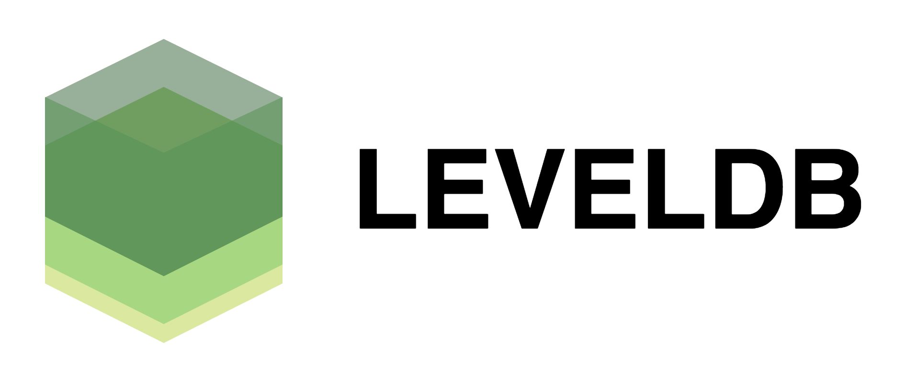
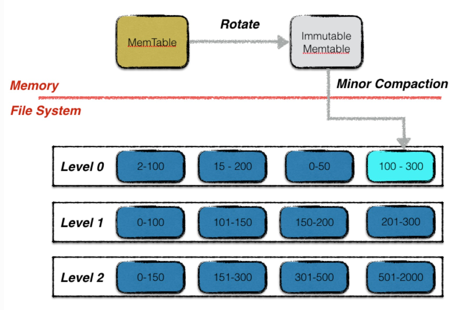
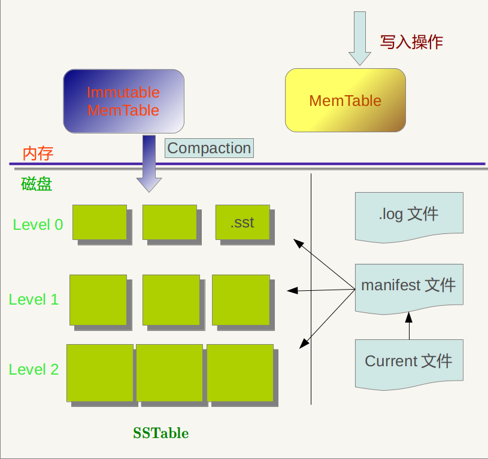
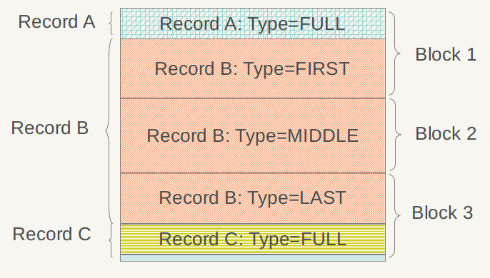
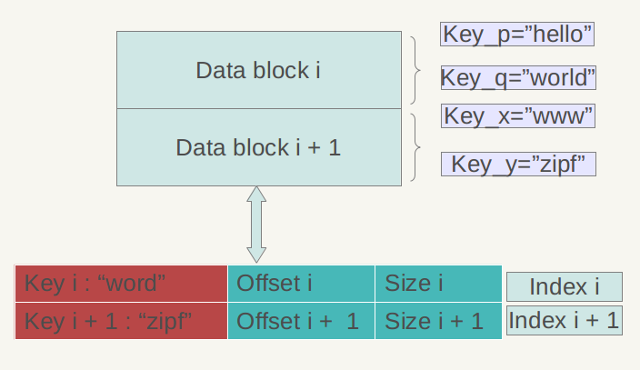

# LevelDB

## Abstract
LevelDB is an open source on-disk key-value store written by Google fellows Jeffrey Dean and Sanjay Ghemawat. Inspired by Bigtable, LevelDB is hosted on GitHub under the New BSD License and has been ported to a variety of Unix-based systems, Mac OS X, Windows, and Android.

-----

## Table of Contents

- [1. Introduction](#Introduction)
- [2. Stakeholders](#Stakeholders)
- [3. Context View](#Context_View)
  - [3.1 leveldb in Bigtable](#leveldb_in_Bigtable)
  - [3.2 Platform & Dependency](#Platform_Dependency)
  - [3.3 Development & Community](#Development_Community)
- [4. Functional View](#Functional_View)
- [5. Architecture](#Architecture)
  - [5.1 Module View](#Module_View)
  - [5.2 Common Design Models](#Common_Design_Models)
- [6. Evolution Perspective](#Evolution_Perspective)
- [7. Technical Debt Analysis](#Technical_Debt_Analysis)
- [8. Conclusion](#Conclusion)
- [9. References](#References)

&nbsp;   

## 1. Introduction

LevelDB is based on concepts from Google's Bigtable database system. The table implementation for the Bigtable system was developed starting in about 2004, and is based on a different Google internal code base than the LevelDB code. That code base relies on a number of Google code libraries that are not themselves open sourced, so directly open sourcing that code would have been difficult. Jeff Dean and Sanjay Ghemawat wanted to create a system resembling the Bigtable tablet stack that had minimal dependencies and would be suitable for open sourcing, and also would be suitable for use in Chrome for the IndexedDB implementation. They wrote LevelDB starting in early 2011, with the same general design as the Bigtable tablet stack, but not sharing any of the code.

### Features

- Keys and values are arbitrary byte arrays.
- Data is stored sorted by key.
- Callers can provide a custom comparison function to override the sort order.
- The basic operations are `Put(key,value)`, `Get(key)`, `Delete(key)`.
- Multiple changes can be made in one atomic batch.
- Users can create a transient snapshot to get a consistent view of data.
- Forward and backward iteration is supported over the data.
- Data is automatically compressed using the [Snappy compression library](http://google.github.io/snappy/).
- External activity (file system operations etc.) is relayed through a virtual interface so users can customize the operating system interactions.

&nbsp;   

## 2. Stakeholders

To start off our analysis, we will look at the stakeholders involved with levelDB. A stakeholder is an entity of a system architecture that consists of an individual or an organization that has importance and interest to realize a system.

LevelDB is used as the backend database for Google Chrome's IndexedDB and is one of the supported backends for Riak. Additionally, Bitcoin Core stores the blockchain metadata using a LevelDB database. Minecraft: Pocket Edition uses a modified version for chunk and entity data storage. Autodesk AutoCAD 2016 also uses LevelDB.   

### [levelDB is used in Bitcoin](https://github.com/bitcoin/bitcoin/tree/master/src/leveldb)

Bitcoin uses LevelDB to store and retrieve block information.

On the subject of why LevelDB is used, core developer Greg Maxwell stated the following to the bitcoin-dev mailing list in October 2015:
>I think people are falling into a trap of thinking "It's a <database>, I know a <black box> for that!"; but the application and needs are very specialized here. . . It just so happens that on the back of the very bitcoin specific cryptographic consensus algorithim there was a slot where a pre-existing high performance key-value store fit; and so we're using one and saving ourselves some effort...

[How is Bitcoin using LevelDB? - Quroa](https://www.quora.com/How-is-Bitcoin-using-LevelDB)   
[Bitcoin Core 0.11 (ch 2): Data Storage](https://en.bitcoin.it/wiki/Bitcoin_Core_0.11_(ch_2):_Data_Storage)   

### [levelDB is used in frontend](http://leveldb.org/)

[Node.js support package on Github](https://github.com/Level/level)

The Node.js Community built [level](https://github.com/Level/level) (Fast & simple storage - a Node.js-style LevelDB wrapper).

[Richard Astbury](https://coderead.wordpress.com/2013/04/04/node-js-leveldb/):
>This article is based on a recent NodeUp podcast dedicated to LevelDB, I recommend listening to it.   
I have played around a bit with Level, and I’ve been really impressed by it’s speed, ease and simplicity. You should give it a go.

&nbsp;   

## 3. Context View

leveldb is a BigTable-inspired key-value database library. It’s available for Unix based systems, Mac OS X, Windows, and Android… LevelDB is not a database server like other other key-value stores like Redis or Membase. Instead, it would most likely be used as an embedded database for other applications, much the way SQLite or Berkley DB are used. The technical advantage to using LevelDB instead of other key-value stores is its support for ordered data. Also, its BSD license is more liberal than the GPL Sleepycat license of Berkley DB.”

&nbsp;   

### 3.1 leveldb in Bigtable

Bigtable is built on several other pieces of Google infrastructure such as levelDB and the distributed Google File System (GFS).   
The levelDB SSTable file format is used internally to
store Bigtable data. An SSTable provides a persistent,
ordered immutable map from keys to values, where both
keys and values are arbitrary byte strings. Operations are provided to look up the value associated with a specified key, and to iterate over all key/value pairs in a specified key range. Internally, each SSTable contains a sequence of blocks (typically each block is 64KB in size, but this is configurable). A block index (stored at the end of the SSTable) is used to locate blocks; the index is loaded into memory when the SSTable is opened. A lookup can be performed with a single disk seek: we first find the appropriate block by performing a binary search in the in-memory index, and then reading the appropriate block from disk. Optionally, an SSTable can be completely mapped into memory, which allows us to perform lookups and scans without touching disk.

### 3.2 Platform & Dependency

#### [Levelup](https://github.com/Level/levelup)
Levelup is a Node.js project that aims to provide a common, portable interface to a multitude of LevelDB forks such as Hyperdex. Check out the many flavours of LevelDB made available though this project.

#### Embeddable & Networkable
LevelDB is embedded, but can be networked adding protocols such as http, tcp or udp to your process.

### 3.3 Development & Community

A platform that plays an important role during development is GitHub, which is used for code versioning, issue tracking and project management.[leveldb on Github](https://github.com/google/leveldb)

Discussion group for LevelDB. LevelDB is a open source library that implements a fast persistent key-value store.[leveldb Group on Google Forum](https://groups.google.com/forum/#!forum/leveldb)

&nbsp;   

## 4. Functional View

&nbsp;   

## 5. Architecture

levelDB is NoSQL database, which adopt sequential writing strategy other than random I/O.

&nbsp;   

## 5.1 Module View

As can be seen from the diagram, a LevelDb static structure consists of six main parts: several main file memory in the MemTable and Immutable MemTable and disk: Current file, Manifest file, log file and SSTable file. Of course, LevelDb in addition to the six main parts and some auxiliary files, but these six files and data structure is the main body of the LevelDb elements.

The Log file is consistent with LevelDb and Memtable and Bigtable in the paper., When applied to write a Key:Value record, LevelDb will first go to the log file write, After the success of the record is inserted into the Memtable, So basically completed write operations, For a write operation only involves writing a sequential write once memory and disk, So this is why the main reason LevelDb write fast.

Effect of Log files in the system is mainly used for system crash recovery without loss of data, if there is no Log file, because the written records began is stored in main memory, at this time if the system crashes, the memory of the data have not yet Dump to disk, so the loss of data (Redis problem). To avoid this situation, LevelDb in writing to the memory before the first operation records to the Log file, and then re entered in the memory, so that even if the system crashes, can also restore memory in the Memtable from the Log file, will not cause the loss of data.

When the Memtable is inserted into the data memory to a limit, Need to be exported to the external memory record file, The LevleDb generates a new Log file and Memtable, The original Memtable becomes Immutable Memtable, Seeing the name of a thing one thinks of its function, This means that the contents of Memtable and cannot be changed, Can read but not write or delete. The new coming data is recorded in the new Log file and Memtable, LevelDb background scheduling can export data from a Immutable Memtable to the disk, the formation of a new SSTable file. The formation of SSTable is composed of data in memory has derived and Compaction after operation, and all of the file SSTable is a hierarchical structure, the first layer is the second layer of Level 0, Level 1, and so on, the level gradually increased, which is why called LevelDb causes.

The SSTable file is Key order, That is in the file and key records before Key records, So are all of the Level SSTable, But one thing to note here is: Level 0 SSTable file (..sst) and other Level files compared with special: the levels of.Sst file, Two files may have overlapping key, For example there are two level and 0 SST file, The file A and file B, The file A is the key range: {bar, car}, The file B is the Key range{blue,samecity}, It is very likely that the existence of two documents are key= "blood" record. For other Level SSTable file, does not have the same level of.Sst files within key overlap phenomenon, is that any Level L two.Sst files, you can guarantee that their key values are not overlap. This requires special attention, you will see the difference behind many operations are caused due to this reason.

&nbsp;   

## 5.2 Common Design Models

In this section, common designs that are used and standardized in the development of levelDB are described.

### Manifest storage

A file in SSTable belongs to a certain level, and its storage record is key ordered, then there must be a minimum in the key file and key, this is very important information, LevelDb should take note of these information. Manifest is doing, it records the management information of each SSTable file, for example, which belongs to the Level, the name of the file name, what is the minimum key and maximum key. Below is a schematic Manifest storage content:

### Log File

The main action section about log in the LevelDb file system recovery, to ensure no loss of data. Because before the record to write into the memory of the Memtable, Will be the first to write to the Log file, So even if the system fault, The data in the Memtable before the Dump SSTable file to disk, LevelDB can also be based on the Memtable data structure log file recovery memory, The system will not result in loss of data, LevelDb at this point and Bigtable are identical.

Below we have a look the specific physical and logical layout of the log file is what, LevelDb for a log file, Will cut it down to a physical unit of Block based on 32K, Each reading unit to read a Block as basic unit, The log file which is composed of 3 Block, So from the physical layout of speaking, A log file is composed of continuous 32K size Block.

### Cache

### Memtable

This section describes the data structure of Memtable memory, an important position in the whole system of Memtable is self-evident. Overall, All k-v data is stored in the Memtable, Immutable Memtable and in SSTable, Immutable Memtable and from the structure of Memtable is exactly the same, The only difference is that it is read-only, Do not allow write operations, While the Memtable is allowed to write and read. When Memtable writes data to a specified number of memory, it is automatically converted to Immutable Memtable, waiting for Dump to the disk, the system will automatically generate a new Memtable for write operation to write new data, understand the Memtable, then Immutable Memtable natural be nothing difficult.

LevelDb MemTable provides k-v data will be written, The operation interface is deleted and read the k-v records, But the fact is that Memtable does not exist in the real delete, delete a Key Value in Memtable is implemented as insert a record, But will hit the delete a Key marker, Really delete operation is Lazy, Will in the future in the process of Compaction to remove the k-v.

Of note, LevelDb Memtable k-v on Key is based on the size of the order in the system memory, insert a new k-v, LevelDb to put the k-v into the right position in order to keep this Key order. In fact, LevelDb Memtable is just an interface class, real operation is done through behind SkipList, including the insertion operation and read operations, so the core data structure of Memtable is a SkipList.

### SSTable

SSTable is a Bigtable critical, the same is true for the LevelDb, the LevelDb SSTable implementation details can also help to understand some of the implementation details in Bigtable.

Static layout structure in this section is mainly about SSTable, the hierarchical structure is formed and we put behind the Compaction section details. This section introduces the SSTable a file in the physical layout and logical structure, the understanding of the operation process of LevelDb very helpful.

#### Logical Layout

As you can see from this figure, from the large side, .sst files can be divided into data storage and data management, k-v data storage area storing the actual data management areas, provide some index management data, is more rapid and convenient to find the corresponding record. Two regions are in the block on the basis of that file, in front of the plurality of actual k-v data storage, data storage management behind the data management area. Data management is divided into four different types: Purple Meta Block, data index block red MetaBlock index and a blue and a tail of file block.

#### Data Index

This figure is a schematic diagram of the internal structure of data index. Again, Data Block KV records in the Key arrange the, Each record data index is established on the index information of a Data Block, Each index information includes three contents, Block shown in the figure, the index of index i: the first field red part of the record is greater than or equal to the maximum key data key block i value, The second field points out that the data block I in .sst the starting position in the file, The third field points to Data Block i size (sometimes a data compression).

#### Block data structure

As can be seen from the graph, its interior is divided into two parts, the front is a KV record, the order is based on the Key value from small to large, in the Block tail is some "restart" (Restart Point), is actually some pointer, points out that the Block contents in some recording position.

"The restart point "is stem what of? We have repeatedly stressed, The Block content in the KV record is ordered according to the size of Key, In this way, Two records of adjacent may Key some overlap, For example, key I="the Car", Key i+1="the color",Then there is overlap"the c", In order to reduce the storage capacity of Key, Key i+1 can only store and a different Key part"olor", The common part can be obtained from Key I. Recording of Key content in Block part is so storage, the main purpose is to reduce the storage overhead. "The restart point "the meaning is: at the beginning of this record, no longer take only record the various Key components, but re recording all values of Key, assuming Key i+1 is a restart, then Key will complete storage" the color ", rather than a simple" olor "mode. Block tail is pointed out which records are the restart point.

#### Record format

In the Block content area, The internal structure of each k-v record is what? The figure gives the detailed structure, Each record contains 5 fields: key sharing length, For example, the "olor" record, The key and a record shared Key part length is "the C" length, 5; key non shared length, For "olor", 4; value Key:Value Value points out that the length of the length, In the Value content stored in the field behind the actual Value value; while the key non shared content is the actual storage "olor" the Key string.

### Compaction

&nbsp;   

## 6. Evolution Perspective

&nbsp;   

## 7. Technical Debt Analysis

https://en.bitcoin.it/wiki/Bitcoin_Core_0.11_(ch_2):_Data_Storage#Use_of_LevelDB

&nbsp;   

## 8. Conclusion

&nbsp;   

## 9. References

- [What are the keys used in the blockchain levelDB (ie what are the key:value pairs)?](https://bitcoin.stackexchange.com/questions/28168/what-are-the-keys-used-in-the-blockchain-leveldb-ie-what-are-the-keyvalue-pair)
- [Node.js + LevelDB](https://coderead.wordpress.com/2013/04/04/node-js-leveldb/)
- 
- 
- 
- 
- 

